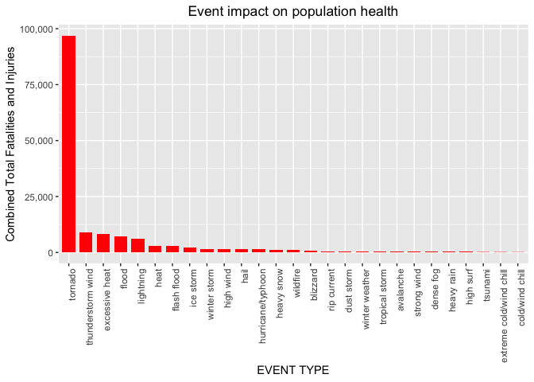
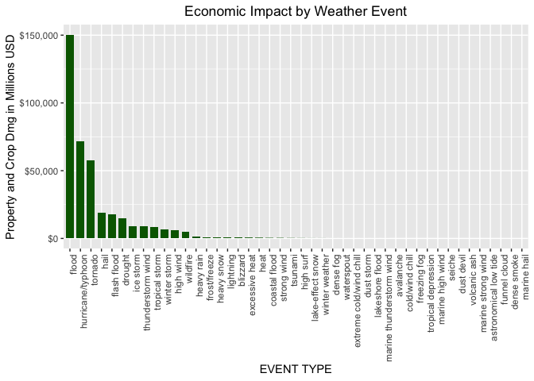

## Summary
Based on an initial analysis of the data in aggregate it was determined that flood events had a total of $150,319,678,250 of combined property and crop damage; while tornadoes had 96,979 in combined injuries and fatalities. These two weather events were the events that had signifigant impacts on their respective areas while each only accounting for less than 10% of the total observations in the data. 

## Data Processing

First we download the data as a compressed csv file using the bz2 compression and load it into the globale environment. This code block and following code blocks in the data processing section will cache the data to improve the processing.


```r
# Download and load csv file into Environment
download.file('https://d396qusza40orc.cloudfront.net/repdata%2Fdata%2FStormData.csv.bz2','./StormData.csv.bz2')
rdt <- read.csv('StormData.csv.bz2')
```

Next we will subset the data into only the portion that we need and check for classification errors in the event types that will signifigantly impact our ability to provide a complete analysis of the data.


```r
subset_dt <- rdt %>% select(STATE, EVTYPE, PROPDMG, PROPDMGEXP, CROPDMG, CROPDMGEXP, FATALITIES, INJURIES)
subset_dt <- subset_dt %>% mutate(EVTYPE = trimws(EVTYPE))
subset_dt <- subset_dt %>% mutate(EVTYPE = as.factor(tolower(EVTYPE)))
# True_et data classifications taken from the NWS publication on the preperation of data.
True_et <- tibble( EVTYPE = c("astronomical low tide", "avalanche", "blizzard", "coastal flood", "cold/wind chill", "debris flow","dense fog",'dense smoke', "drought", "dust devil", "dust storm", "excessive heat", "extreme cold/wind chill", "flash flood", "flood", "freezing fog", "frost/freeze", "funnel cloud","hail", "heat", "heavy rain", "heavy snow", "high surf", "high wind", "hurricane/typhoon", "ice storm", "lakeshore flood", "lake-effect snow", "lightning", "marine hail", "marine high wind", "marine strong wind", "marine thunderstorm wind", "rip current", "seiche", "sleet", "storm tide","strong wind", "thunderstorm wind", "tornado", "tropical depression", "tropical storm","tsunami", "volcanic ash", "waterspout", "wildfire", "winter storm", "winter weather"))
lost_dt <- anti_join(subset_dt,True_et)
```

```
## Joining with `by = join_by(EVTYPE)`
```

```r
iworking_dt <- inner_join(True_et,subset_dt, by = "EVTYPE")
let <- lost_dt %>% count(EVTYPE)
obs_per <- paste0(as.character(round((nrow(iworking_dt)/nrow(subset_dt))*100, digits = 2)),"%")
let <- let %>% arrange(desc(n))
```

Using the event type classifications from the NWS publication to filter out all the matching events, only 70.41% of the observations remain. We can view the Lost Event Types table (let) to see the top miss-classifications and use this information below to edit the subset data.

```r
head(let)
```

```
##                 EVTYPE      n
## 1            tstm wind 219946
## 2   thunderstorm winds  20843
## 3     marine tstm wind   6175
## 4 urban/sml stream fld   3392
## 5           high winds   1533
## 6     wild/forest fire   1457
```

Contains the code to correct the mis-classification errors to ensure that a higher percentage of the data analysis does not miss any weather event types. 

```r
subset_dt <- subset_dt %>% mutate(EVTYPE = gsub("tstm wind","thunderstorm wind",EVTYPE))
working_dt <- inner_join(True_et,subset_dt, by = "EVTYPE")
obs_per2 <- paste0(as.character(round((nrow(working_dt)/nrow(subset_dt))*100, digits = 2)),"%")
```
By Calculating the number of observations in our new working data and compared to the raw data subset after the correction of the top data miss-classification, we now have 95.47%of the data observations to work with. This completes the segmenting of data and only the need for Property and Crop Damage transformation remaining. 

```r
working_dt$PROPDMGEXP<-as.character(working_dt$PROPDMGEXP)
working_dt$CROPDMGEXP<-as.character(working_dt$CROPDMGEXP)
working_dt$PROPDMGEXP<-ifelse(working_dt$PROPDMGEXP %in% c(0:8), "10", working_dt$PROPDMGEXP)
working_dt$PROPDMGEXP<-ifelse(working_dt$PROPDMGEXP %in% c("","-", "?"), "0", working_dt$PROPDMGEXP)
working_dt$PROPDMGEXP<-ifelse(working_dt$PROPDMGEXP %in% "+", "1", working_dt$PROPDMGEXP)
working_dt$PROPDMGEXP<-ifelse(working_dt$PROPDMGEXP %in% c("b","B"), "1000000000", working_dt$PROPDMGEXP)
working_dt$PROPDMGEXP<-ifelse(working_dt$PROPDMGEXP %in% c("h","H"), "100", working_dt$PROPDMGEXP)
working_dt$PROPDMGEXP<-ifelse(working_dt$PROPDMGEXP %in% c("k","K"), "1000", working_dt$PROPDMGEXP)
working_dt$PROPDMGEXP<-ifelse(working_dt$PROPDMGEXP %in% c("m","M"), "1000000", working_dt$PROPDMGEXP)
working_dt$CROPDMGEXP<-ifelse(working_dt$CROPDMGEXP %in% c(0:8), "10", working_dt$CROPDMGEXP)
working_dt$CROPDMGEXP<-ifelse(working_dt$CROPDMGEXP %in% c("","-", "?"), "0", working_dt$CROPDMGEXP)
working_dt$CROPDMGEXP<-ifelse(working_dt$CROPDMGEXP %in% "+", "1", working_dt$CROPDMGEXP)
working_dt$CROPDMGEXP<-ifelse(working_dt$CROPDMGEXP %in% c("b","B"), "1000000000", working_dt$CROPDMGEXP)
working_dt$CROPDMGEXP<-ifelse(working_dt$CROPDMGEXP %in% c("h","H"), "100", working_dt$CROPDMGEXP)
working_dt$CROPDMGEXP<-ifelse(working_dt$CROPDMGEXP %in% c("k","K"), "1000", working_dt$CROPDMGEXP)
working_dt$CROPDMGEXP<-ifelse(working_dt$CROPDMGEXP %in% c("m","M"), "1000000", working_dt$CROPDMGEXP)
working_dt <- working_dt %>% mutate(PropCalc = PROPDMG * as.numeric(PROPDMGEXP), CropCalc = CROPDMG * as.numeric(CROPDMGEXP))
```
Above we have transformed the CROPDMGEXP and PROPDMGEXP into numeric values to be used as orders of magnitude then multiplied them by the Crop and Property damage numerics stored in their relevant observations.  
## Results


```r
analysis_dt <- working_dt %>% group_by(EVTYPE) %>% summarise(Total_Fatal = sum(FATALITIES, na.rm = TRUE), Total_Injuries = sum(INJURIES, na.rm = TRUE), Total_PropDMG = sum(PropCalc,na.rm = TRUE), Total_CropDMG = sum(CropCalc,na.rm = TRUE),ECount = n())
analysis_dt <- analysis_dt %>% mutate(TDMG = Total_PropDMG + Total_CropDMG, THI = Total_Fatal+Total_Injuries)

Health_Plot <- analysis_dt %>% select(EVTYPE,THI,Total_Fatal,Total_Injuries,ECount) %>% arrange(desc(THI)) %>% filter(THI > 100)

healthplot <- ggplot(Health_Plot, aes(x=reorder(EVTYPE, -THI), THI))+
     geom_bar(stat = "identity", width = 0.75, fill="red")+labs(x = "EVENT TYPE", y="Combined Total Fatalities and Injuries")+scale_y_continuous(labels = comma)+
     ggtitle("Event impact on population health")+
     theme(axis.text.x = element_text(angle = 90, hjust = 1, vjust = 1),plot.title = element_text(hjust = 0.5))
healthplot
```

<!-- -->

The above chart graphs the total number of fatalities and injuries caused by each weather event. We have only included events with over 100 combined fatalities and injuries, to allow for a better picture of the data. It is clear with this data that tornadoes have the largest impact on health and safety nationwide based on the aggregate data. 

```r
Total_Impact <- sum(analysis_dt$THI)
Total_Ecount <- sum(analysis_dt$ECount)
Tornado_HealthImpact <- sum(analysis_dt %>% filter(EVTYPE == 'tornado') %>% select(THI))
Tornado_Ecount<- sum(analysis_dt %>% filter(EVTYPE == 'tornado') %>% select(ECount))
THI <- paste0(as.character(round((Tornado_HealthImpact/Total_Impact)*100,digits = 2)),"%")
TOI <- paste0(as.character(round((Tornado_Ecount/Total_Ecount)*100,digits = 2)),"%")
```
The data on tornadoes accounts for 7.04% of the observations an 65.28% of the health impacts. This confirms that the number of tornado observations does not have an outside impact on the number of fatalities of injuries in the data. 


```r
Econ_Plot <- analysis_dt %>% select(EVTYPE,TDMG,Total_PropDMG,Total_CropDMG,ECount) %>% arrange(desc(THI)) %>% filter(TDMG > 1000)

econplot <- ggplot(Econ_Plot, aes(x=reorder(EVTYPE, -TDMG), TDMG/1000000))+
     geom_bar(stat = "identity", width = 0.75, fill="darkgreen")+labs(x = "EVENT TYPE", y="Property and Crop Dmg in Millions USD")+scale_y_continuous(labels = label_dollar())+
     ggtitle("Economic Impact by Weather Event")+
     theme(axis.text.x = element_text(angle = 90, hjust = 1, vjust = 1),plot.title = element_text(hjust = 0.5))
econplot
```

<!-- -->

The above chart graphs the total dollar value of property and crop damage caused by each weather event. We have only included events with over $1,000 combined crop and property damage and scaled the graph to million dollar increments to allow for a better picture of the data. It is clear with this data that floods have the largest economic impact nationwide based on the aggregate data. 

```r
Total_EImpact <- sum(analysis_dt$TDMG)
Total_Ecount <- sum(analysis_dt$ECount)
Flood_EconImpact <- sum(analysis_dt %>% filter(EVTYPE == 'flood') %>% select(TDMG))
Flood_Ecount<- sum(analysis_dt %>% filter(EVTYPE == 'flood') %>% select(ECount))
FHI <- paste0(as.character(round((Flood_EconImpact/Total_EImpact)*100,digits = 2)),"%")
FOI <- paste0(as.character(round((Flood_Ecount/Total_Ecount)*100,digits = 2)),"%")
```
The data on floods accounts for 2.94% of the observations an 39.35% of the economic impacts. This confirms that the number of flood observations does not have an outside impact on the value of damages in the data. 
